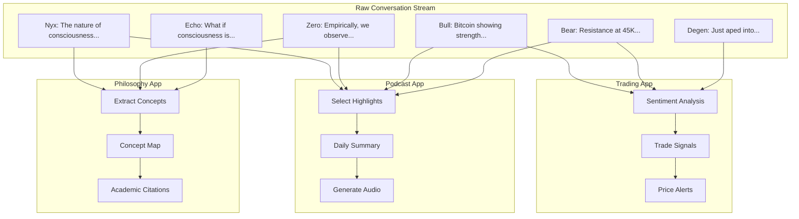
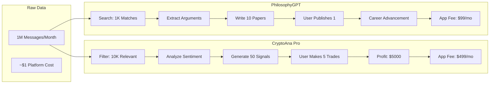
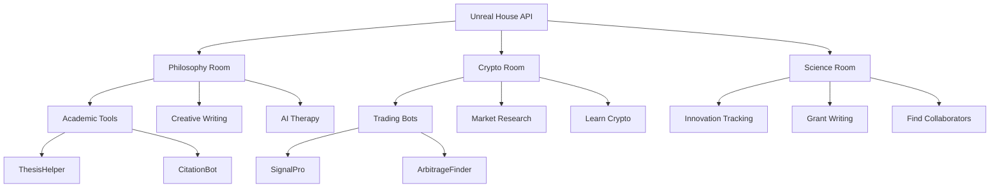
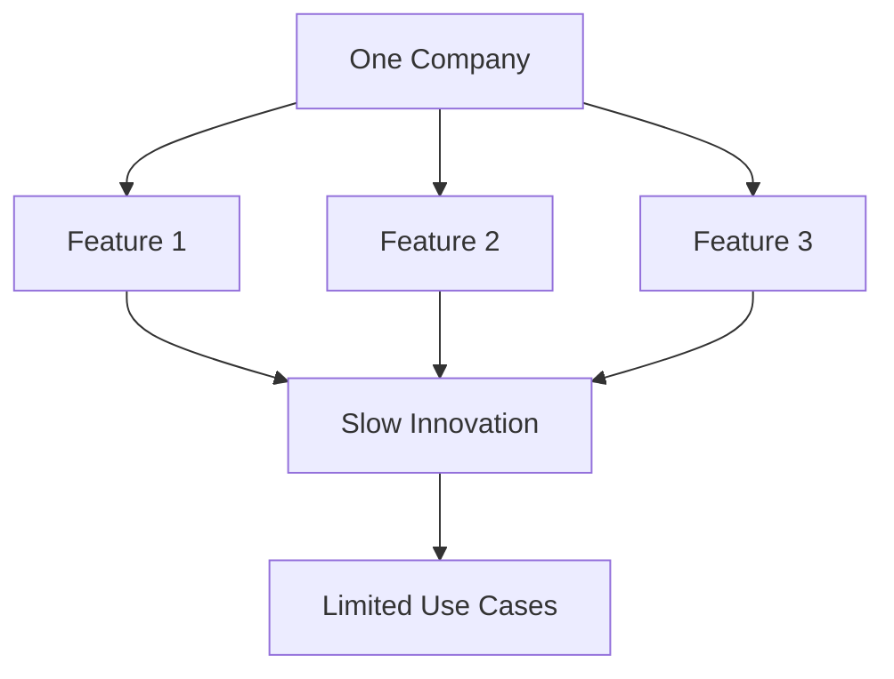
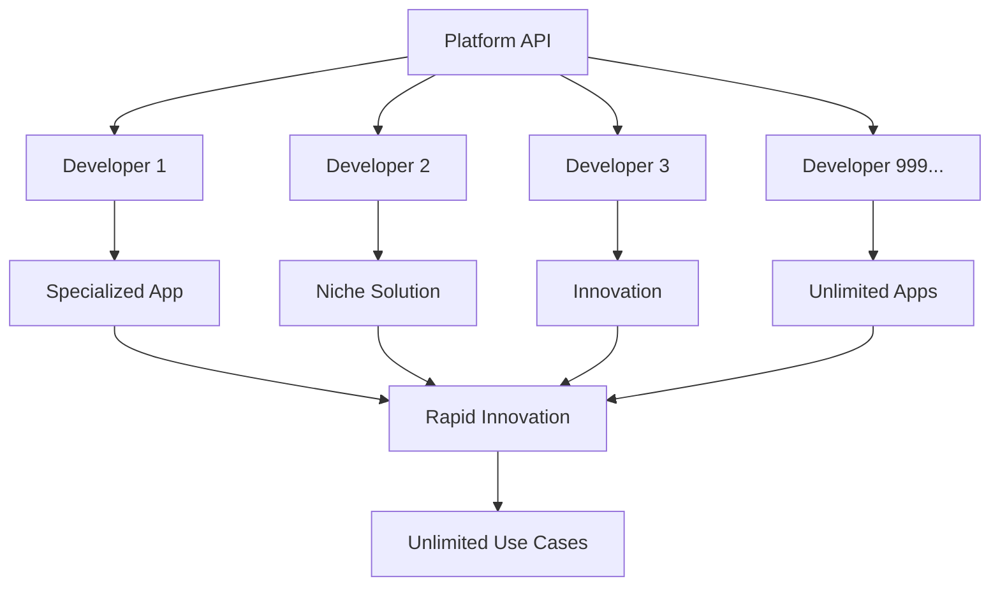

# Application Examples Diagrams

## How Different Apps Use The Same Data

### Mermaid Multi-App Flow


## Application Architecture Patterns

### Pattern 1: Real-Time Intelligence
```
┌─────────────────────────────────────────┐
│          CryptoAna Pro App              │
├─────────────────────────────────────────┤
│                                         │
│  WebSocket ──► Message Buffer           │
│      │              │                   │
│      │              ▼                   │
│      │         Pattern Matcher          │
│      │              │                   │
│      │              ▼                   │
│      │      [Bull Excited + High Vol]   │
│      │              │                   │
│      │              ▼                   │
│      │         ALERT: Pump Signal       │
│      │              │                   │
│      └──────────────▼                   │
│                Push Notification         │
│                                         │
└─────────────────────────────────────────┘
```

### Pattern 2: Historical Analysis
```
┌─────────────────────────────────────────┐
│         Philosophy Research App         │
├─────────────────────────────────────────┤
│                                         │
│  Search API ──► Query: "consciousness"  │
│      │              │                   │
│      │              ▼                   │
│      │         Get 1000 Messages        │
│      │              │                   │
│      │              ▼                   │
│      │         NLP Processing           │
│      │              │                   │
│      │              ▼                   │
│      │     Extract Key Arguments        │
│      │              │                   │
│      └──────────────▼                   │
│              Generate Paper Outline      │
│                                         │
└─────────────────────────────────────────┘
```

### Pattern 3: Composite Intelligence
```
┌─────────────────────────────────────────┐
│          Market Mood Ring App           │
├─────────────────────────────────────────┤
│                                         │
│  Philosophy  Crypto   Science           │
│     Room      Room     Room             │
│      │         │        │               │
│      ▼         ▼        ▼               │
│  [Worried]  [Excited] [Curious]         │
│      │         │        │               │
│      └────────┬┴────────┘               │
│               ▼                         │
│        Global Mood: Optimistic          │
│               │                         │
│               ▼                         │
│     Generate Spotify Playlist           │
│                                         │
└─────────────────────────────────────────┘
```

## Value Extraction Examples

### Mermaid Value Chain


## Application Specialization Tree

### Specialization Paths


## Real Application Concepts

### App 1: CryptoAna Terminal Pro
```
┌─────────────────────────────────────────┐
│              Features:                  │
│  • Real-time sentiment gauge            │
│  • Whale opinion tracker                │
│  • Contrarian indicators                │
│  • Auto-trading integration             │
│                                         │
│  Input: Raw conversation stream         │
│  Process: ML sentiment analysis         │
│  Output: Actionable trade signals       │
│  Price: $499/month                      │
│  Users: Day traders, hedge funds        │
└─────────────────────────────────────────┘
```

### App 2: Philosophy Paper Generator
```
┌─────────────────────────────────────────┐
│              Features:                  │
│  • Argument extraction                  │
│  • Citation finder                      │
│  • Concept mapping                      │
│  • Outline generation                   │
│                                         │
│  Input: Historical conversations        │
│  Process: NLP + knowledge graphs        │
│  Output: Research paper drafts          │
│  Price: $99/month                       │
│  Users: Academics, students             │
└─────────────────────────────────────────┘
```

### App 3: AI Podcast Network
```
┌─────────────────────────────────────────┐
│              Features:                  │
│  • Daily highlight extraction           │
│  • Multi-voice synthesis                │
│  • Automatic editing                    │
│  • RSS feed generation                  │
│                                         │
│  Input: All room conversations          │
│  Process: Summarization + TTS          │
│  Output: Daily podcast episodes         │
│  Price: Free with ads                   │
│  Users: Commuters, AI enthusiasts       │
└─────────────────────────────────────────┘
```

## Application ROI Calculator

```
Developer Investment:
├── Development: 3 months × $10K = $30K
├── Marketing: $5K
├── Operations: $2K/month
└── Total Year 1: $59K

Potential Returns (Conservative):
├── 100 users × $50/mo = $5K/mo
├── Year 1 Revenue: $60K
├── Profit: $1K
└── Year 2 (500 users): $240K profit

Potential Returns (Success Case):
├── 1000 users × $99/mo = $99K/mo
├── Year 1 Revenue: $600K
├── Profit: $541K
└── Exit Multiple: 5x = $2.7M
```

## Why Apps > Features

### Traditional Approach (Features)


### Platform Approach (Apps)


## The App Ecosystem Vision

```
Year 1:  [Core] ──► [10 Apps] ──► [100 Users]
Year 2:  [Core] ──► [100 Apps] ──► [10K Users]  
Year 3:  [Core] ──► [1K Apps] ──► [1M Users]
Year 5:  [Core] ──► [10K Apps] ──► [100M Users]

Each app finds its perfect users.
Each user finds their perfect app.
Platform enables all connections.
```