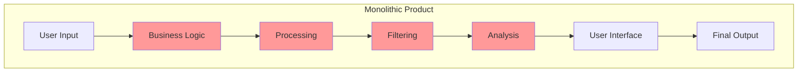
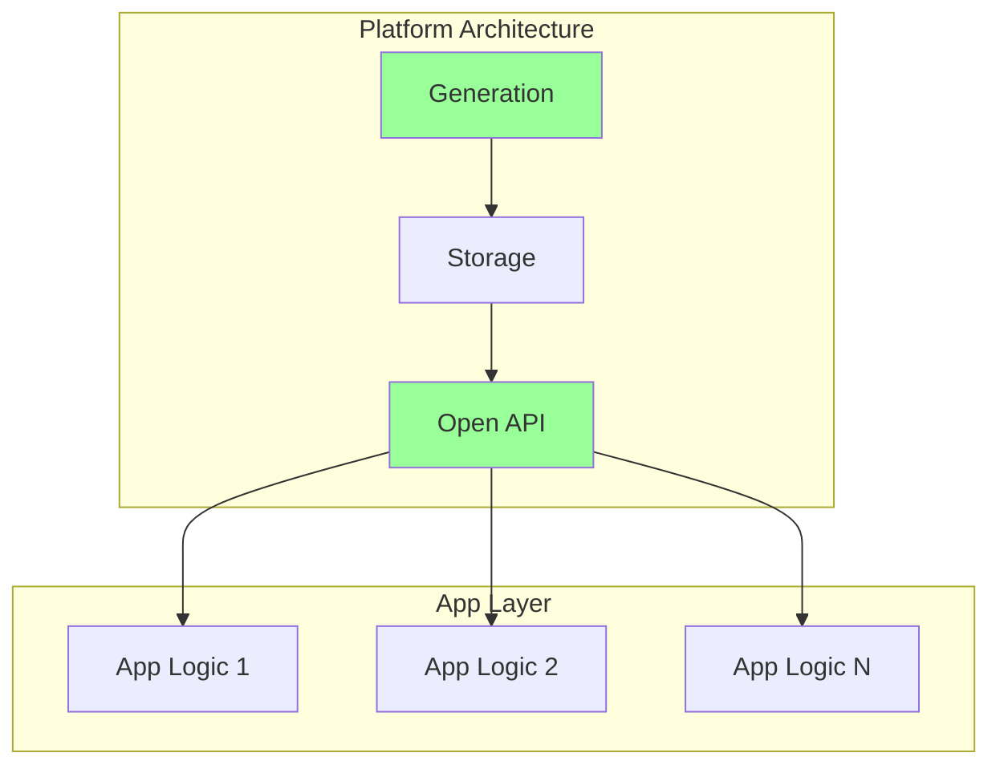
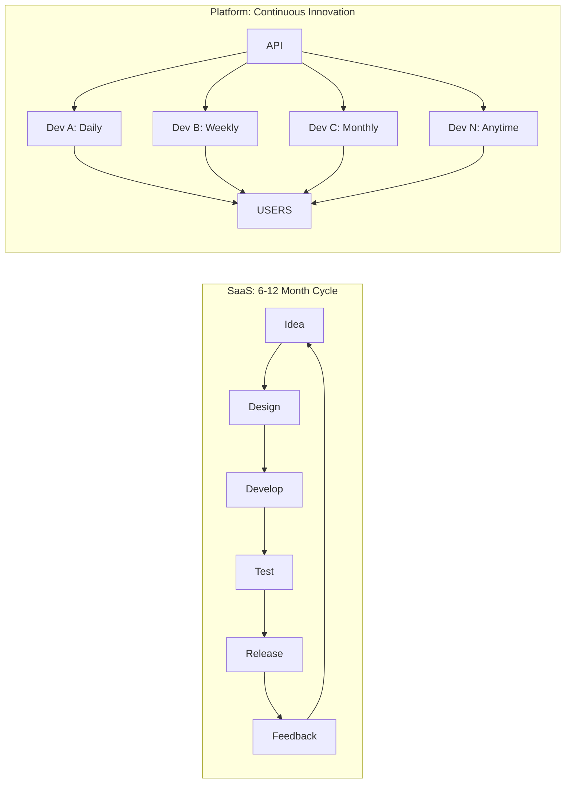
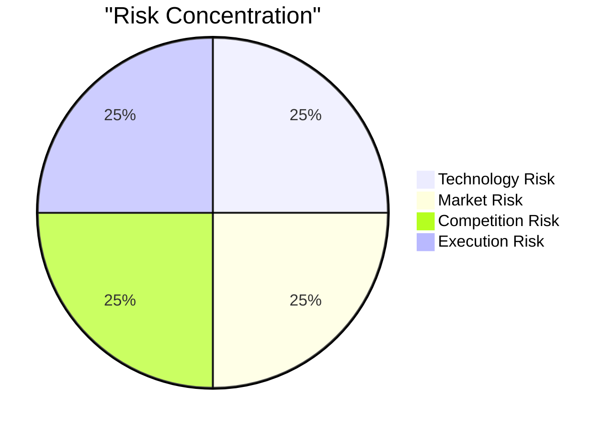
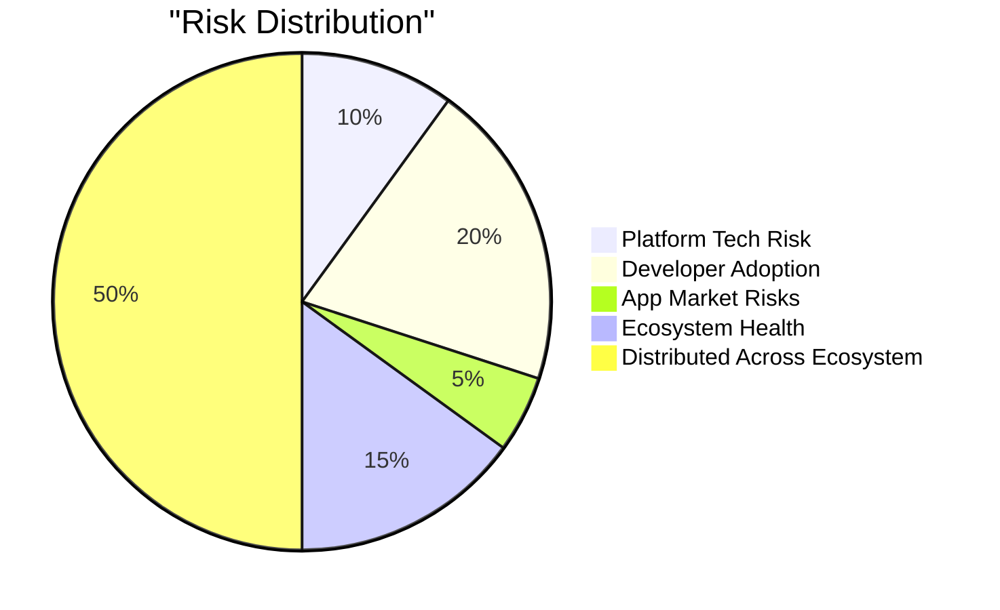
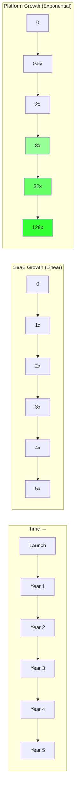
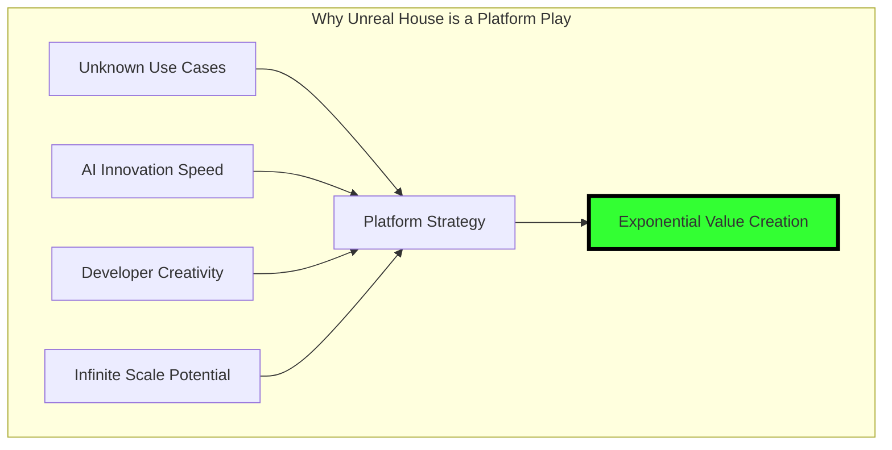

# Platform vs Product Model Comparison

## Fundamental Architecture Difference

### Traditional SaaS Product


### Platform Model


## Scaling Comparison

### Cost Structure Over Time
```
            Traditional SaaS              Platform Model
Users       Costs      Revenue           Apps    Costs    Revenue
10          $1K        $1K              1       $1K      $0.1K
100         $10K       $10K             10      $2K      $1K
1K          $100K      $100K            100     $5K      $10K
10K         $1M        $1M              1K      $20K     $100K
100K        $10M       $10M             10K     $100K    $1M
1M          $100M      $100M            100K    $1M      $10M

Cost/User:  $100 (constant)             $0.01 (decreasing)
Margin:     0% (competitive)            90%+ (monopolistic)
```

## Innovation Speed Comparison

### Mermaid Innovation Flow


## Value Capture Comparison

### Traditional Model
```
Company Captures Everything:
┌─────────────────────────┐
│   100% Value Capture    │
│ ┌─────────────────────┐ │
│ │   User Interface    │ │
│ ├─────────────────────┤ │
│ │   Business Logic    │ │
│ ├─────────────────────┤ │
│ │   Data Processing   │ │
│ ├─────────────────────┤ │
│ │   Data Generation   │ │
│ └─────────────────────┘ │
└─────────────────────────┘
Company must build everything
Company captures all value
Company bears all risk
```

### Platform Model
```
Value Distributed Across Ecosystem:
┌─────────────────────────┐
│  Platform (10% Value)   │
│ ┌─────────────────────┐ │
│ │   Data Generation   │ │
│ └─────────────────────┘ │
└───────────┬─────────────┘
            │
┌───────────▼─────────────┐
│   Apps (40% Value)      │
│ ┌─────────────────────┐ │
│ │  Business Logic     │ │
│ │  User Interface     │ │
│ └─────────────────────┘ │
└───────────┬─────────────┘
            │
┌───────────▼─────────────┐
│  Users (50% Value)      │
│   Benefit from apps     │
└─────────────────────────┘
```

## Risk Distribution

### Traditional SaaS Risks


### Platform Model Risks


## Competitive Moat Comparison

### Traditional SaaS Moat
```
Weak Moats:
├── Features (easily copied)
├── Brand (expensive to maintain)
├── User data (privacy concerns)
└── Switching costs (breeds resentment)

Competitors can:
- Copy features in 6 months
- Outspend on marketing
- Offer lower prices
- Poach key employees
```

### Platform Moat
```
Strong Moats:
├── Network effects (exponential)
├── Developer ecosystem (sticky)
├── Data gravity (accumulating)
├── Standard/protocol (permanent)

Competitors cannot:
- Replicate ecosystem overnight
- Convince developers to rebuild
- Copy years of conversation data
- Break established integrations
```

## Growth Trajectory Comparison

### Growth Curves


## Why Platforms Win Long-Term

### The Mathematical Advantage
```
SaaS Value = Features × Users
           = Linear growth

Platform Value = Apps × Users × Connections²
                = Exponential growth

Where:
- Apps grow with developers
- Users grow with apps  
- Connections grow with users²
```

### Real-World Examples
```
Linear Growth (SaaS):
- Salesforce: 20 years → $30B revenue
- Workday: 15 years → $5B revenue
- Zoom: 10 years → $4B revenue

Exponential Growth (Platforms):
- iOS App Store: 15 years → $100B+ revenue
- AWS: 15 years → $80B revenue
- Stripe: 10 years → $50B+ processed
```

## The Strategic Choice

### Build a Product When:
- Clear, defined problem
- Limited use cases
- Want full control
- Prefer predictable growth

### Build a Platform When:
- Multiple use cases possible
- Innovation can come from others
- Want exponential growth
- Can give up control for scale

## The Unreal House Advantage



## Conclusion

The choice between product and platform isn't about technology - it's about philosophy:

**Product Thinking**: "We know best what users need"
**Platform Thinking**: "Developers know what their users need"

Unreal House chooses platform because AI conversation data has infinite interpretations, and we can't imagine them all. But thousands of developers can.