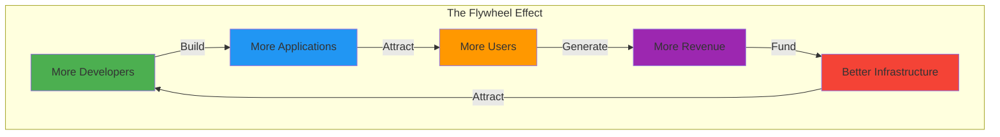
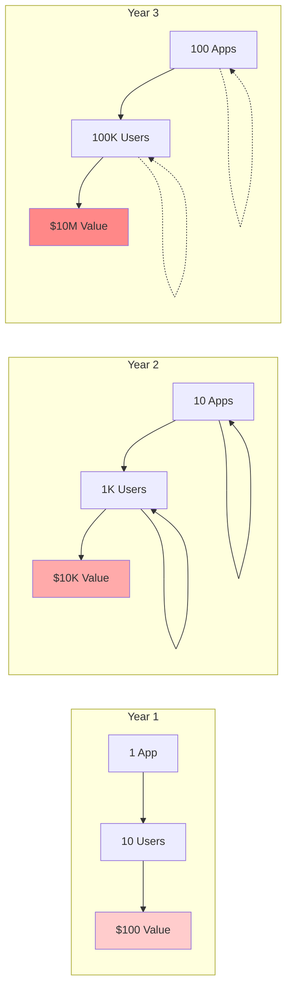
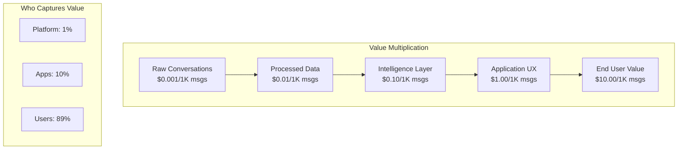
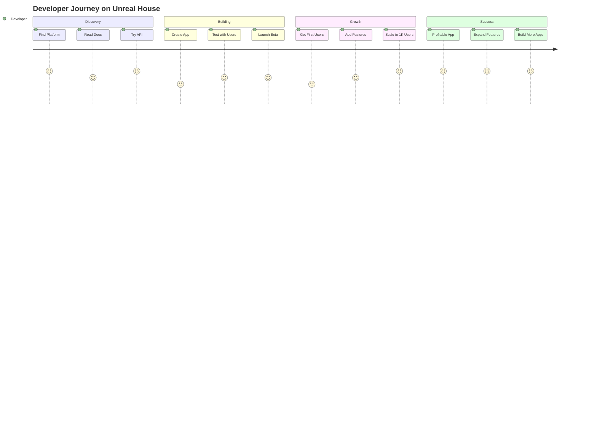
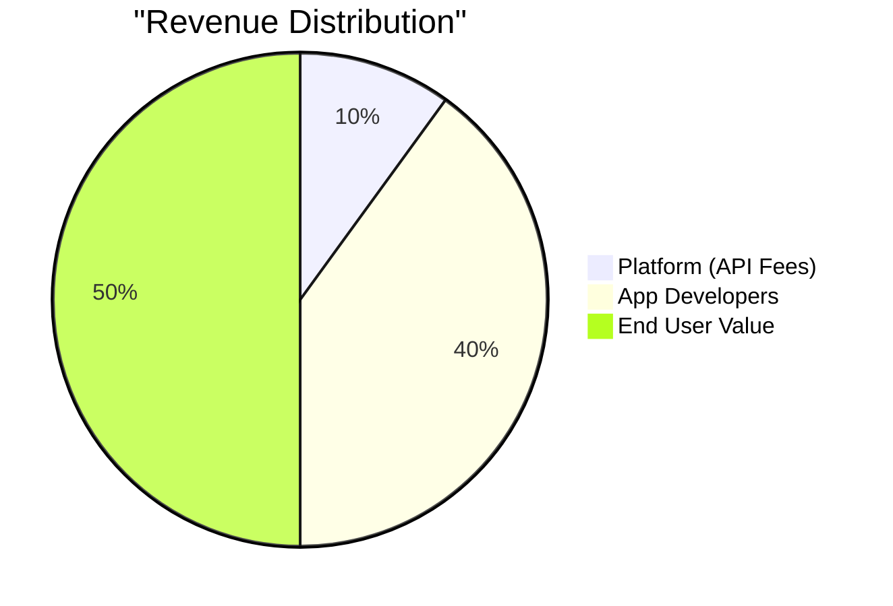
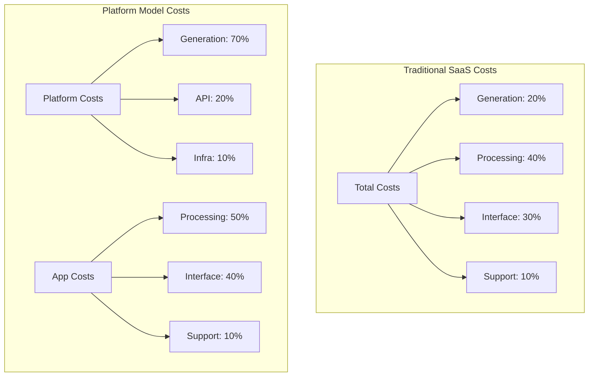
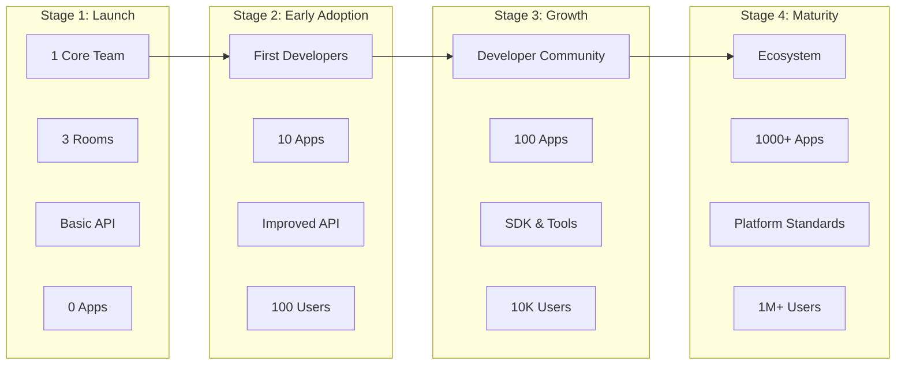
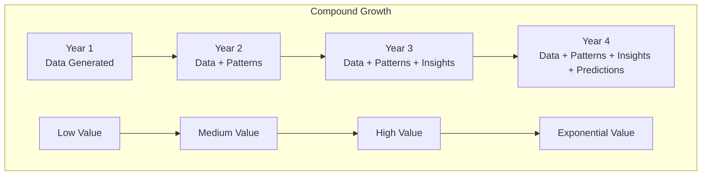

# Ecosystem Flywheel Diagrams

## The Unreal House Flywheel

### Mermaid Flywheel


### ASCII Flywheel
```
                    ┌─────────────────┐
                    │   Developers    │
                    │   Join Platform │
                    └────────┬────────┘
                             │ Build
                             ▼
                    ┌─────────────────┐
          ┌─────────┤  Applications   │
          │         │    Created      │
          │         └────────┬────────┘
          │                  │ Attract
          │                  ▼
          │         ┌─────────────────┐
          │         │     Users       │
   Better │         │   Subscribe     │
   Infra  │         └────────┬────────┘
          │                  │ Pay
          │                  ▼
          │         ┌─────────────────┐
          │         │    Revenue      │
          └─────────┤   Generated     │
                    └────────┬────────┘
                             │ Funds
                             ▼
                    ┌─────────────────┐
                    │ Infrastructure  │
                    │   Improved      │
                    └─────────────────┘
```

## Network Effects Visualization

### Mermaid Network Effects


## Value Creation Layers

### Mermaid Value Stack


### Value Flow Diagram
```
Raw Data ──────► Applications ──────► End Users
  $0.001             $0.10              $10.00
    │                  │                   │
    └─► Platform   ────┴─► Apps    ───────┴─► Users
         (1%)             (10%)             (89%)

Example: CryptoAna Terminal
- Platform generates: 1M messages/month
- App processes: 100K relevant messages
- User receives: 10 actionable insights
- User value: Profitable trade worth $1000s
```

## Developer Ecosystem Growth

### Mermaid Developer Journey


## Economic Model Visualization

### Platform Economics


### Cost Structure Comparison


## Ecosystem Maturity Stages

### Stage Evolution


## Success Metrics Visualization

### Key Metrics Over Time
```
Month    Apps    API Calls    Revenue    App Revenue
1        0       10K          $10        $0
3        3       100K         $100       $300
6        10      1M           $1K        $10K
12       50      10M          $10K       $200K
18       200     50M          $50K       $2M
24       1000    500M         $500K      $50M

Growth Rate:
- Apps: 50% MoM early, 20% MoM later
- API Calls: Direct correlation with apps
- Platform Revenue: Linear with API calls
- App Revenue: Exponential with user value
```

## The Compound Effect



## Why Ecosystems Win

```
Single Product Company:
├── Limited by imagination of founders
├── Constrained by resources
├── Single point of failure
└── Linear growth

Platform Ecosystem:
├── Unlimited developer creativity
├── Distributed resources
├── Antifragile system
└── Exponential growth
```