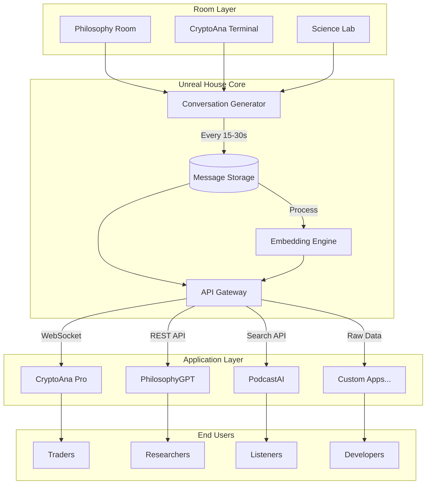
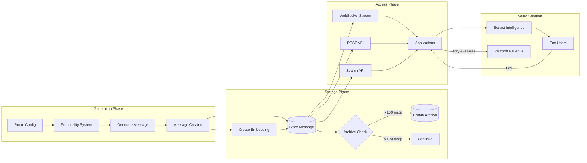
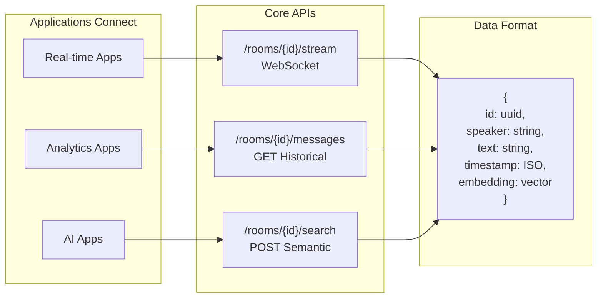
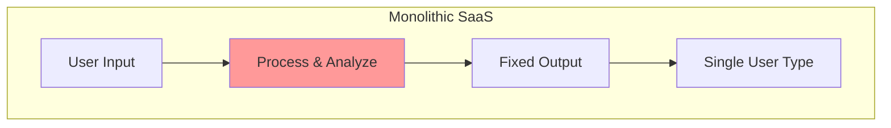
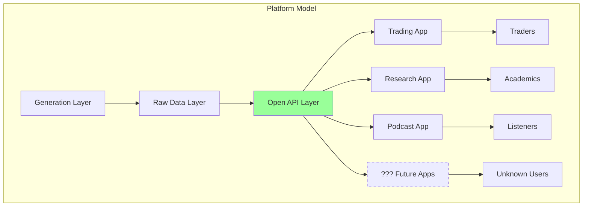
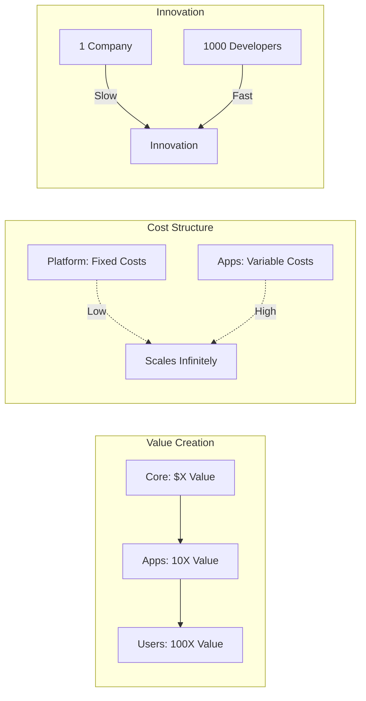

# Platform Architecture Diagrams

## Core Architecture

### Mermaid Diagram


### ASCII Architecture
```
┌─────────────────────────────────────────────────────────┐
│                    UNREAL HOUSE CORE                    │
├─────────────────────────────────────────────────────────┤
│                                                         │
│  [Rooms]          [Generator]         [Storage]        │
│  ┌─────┐         ┌──────────┐       ┌──────────┐     │
│  │Phil │ ───────►│          │       │          │     │
│  │Cryp │ ───────►│    AI    │──────►│ Messages │     │
│  │Sci  │ ───────►│ Messages │       │    +     │     │
│  └─────┘         └──────────┘       │Embeddings│     │
│                                     └─────┬────┘     │
│                                           │           │
│                      ┌────────────────────┘           │
│                      ▼                                │
│                 ┌─────────┐                          │
│                 │   API   │                          │
│                 │ Gateway │                          │
│                 └────┬────┘                          │
│                      │                               │
└──────────────────────┼───────────────────────────────┘
                       │
    ┌──────────────────┼──────────────────┐
    │                  │                  │
    ▼                  ▼                  ▼
[WebSocket]        [REST API]        [Search API]
    │                  │                  │
    ▼                  ▼                  ▼
Applications      Applications      Applications
```

## Data Flow Diagram

### Mermaid Flow


## API Layer Design

### Mermaid API Structure


### Simple API Flow
```
┌──────────────┐     ┌──────────────┐     ┌──────────────┐
│   Room Gen   │     │   Core API   │     │     Apps     │
└──────┬───────┘     └──────┬───────┘     └──────┬───────┘
       │                    │                     │
       │ New Message        │                     │
       ├───────────────────►│                     │
       │                    │                     │
       │                    │ Broadcast           │
       │                    ├────────────────────►│
       │                    │                     │
       │                    │ Store + Embed       │
       │                    ├──┐                  │
       │                    │  │                  │
       │                    │◄─┘                  │
       │                    │                     │
       │                    │ Historical Request  │
       │                    │◄────────────────────┤
       │                    │                     │
       │                    │ Return Messages     │
       │                    ├────────────────────►│
       │                    │                     │
```

## Platform vs Product Architecture

### Traditional SaaS Model


### Unreal House Platform Model


## Scale Comparison

### Product Scaling (Linear)
```
Users:     10    →    100   →   1000
Revenue:   $1K   →    $10K  →   $100K
Costs:     $0.5K →    $5K   →   $50K
Profit:    $0.5K →    $5K   →   $50K
```

### Platform Scaling (Exponential)
```
Apps:      1     →    10    →   100    →   1000
Users:     10    →    1K    →   100K   →   10M
Revenue:   $1K   →    $50K  →   $2M    →   $50M
Costs:     $1K   →    $5K   →   $20K   →   $100K
Profit:    $0    →    $45K  →   $1.98M →   $49.9M
```

## Why Platform Wins

